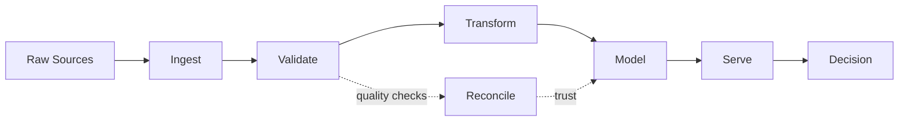

# README.md

<div align="center">

# Daniel Barbosa Brasileiro

### Data Engineering · Analytics · BI

**Accounting context. Engineering mindset. Data quality first.**


<br />

<a href="https://www.linkedin.com/in/daniel-barbosa-brasileiro">
  
</a>
<a href="mailto:danielbarbosabrasileiro@gmail.com">
  
</a>
<a href="https://github.com/DanielBBrasileiro">
  
</a>

</div>

---

## What I do

I build **data products that turn messy operational data into reliable, traceable, and decision-ready information**.

My background in **Accounting** gives me a strong bias toward controls, reconciliation, business meaning, and auditability. My technical work brings that mindset into **SQL, Python, data pipelines, analytical modeling, automation, and BI**.

I am especially interested in problems where data needs to move from:

**raw → validated → modeled → useful**

My work and projects cover:

* data ingestion, transformation, and ETL/ELT workflows;
* SQL modeling, validation, reconciliation, and data quality;
* Python automation and API/file processing;
* analytical models and business metrics;
* Power BI and Tableau reporting;
* reproducible environments, testing, CI, and documentation.

---

# Featured work

## 🏦 FinBank Risk Lakehouse

### From synthetic banking data to validated analytical products

**Python · Rust · dbt · DuckDB · PostgreSQL · Streamlit · GitHub Actions**

[Explore FinBank Risk Lakehouse →](https://github.com/DanielBBrasileiro/finbank-risk-lakehouse)

FinBank is an end-to-end banking-risk data platform built to follow data from **source ingestion to an analyst-facing product**.

The project includes:

* deterministic financial datasets for reproducible testing;
* Python ingestion pipelines;
* Rust-based source contract validation;
* Bronze, Silver, and Gold data layers;
* dbt staging, intermediate, and mart models;
* data quality and reconciliation checks;
* idempotent event replay;
* DuckDB and PostgreSQL execution paths;
* automated CI and security checks;
* a Streamlit credit-risk dashboard;
* documented cloud extension paths.

<a href="https://github.com/DanielBBrasileiro/finbank-risk-lakehouse">
  
</a>

> **What it demonstrates:** analytical engineering, data contracts, dimensional thinking, quality controls, reproducibility, CI, and financial-data context.

---

## 🇧🇷 CNPJ Analytics & Compliance Pipeline

### Turning Brazilian public-company files into an analytical data platform

**Python · Pandas · MinIO · Parquet · PostgreSQL · Docker · Streamlit**

[Explore CNPJ Analytics Pipeline →](https://github.com/DanielBBrasileiro/cnpj-analytics-pipeline)

An end-to-end data engineering project built around public Brazilian company data.

```text
Receita Federal data
        ↓
Bronze — raw files / MinIO
        ↓
Silver — cleaned Parquet datasets
        ↓
Gold — PostgreSQL analytical layer
        ↓
Streamlit
```

The project focuses on:

* reproducible ingestion;
* chunked processing for large files;
* schema and type normalization;
* S3-compatible object storage;
* analytical persistence in PostgreSQL;
* Docker-based local infrastructure;
* data exploration through Streamlit.

> **What it demonstrates:** ingestion, batch processing, data-layer architecture, relational storage, Docker, and working with public data at scale.

---

# How I think about data



For me, a pipeline is not finished when the data arrives.

It is finished when the result is **understandable, reproducible, reconciled, and useful to someone making a decision**.

---

# Toolbox

### Core


### Data Engineering & Analytics Engineering


### BI & Analytics


### Building with

`Rust` · `Airflow` · `Dagster` · `AWS` · `Data Lakehouse patterns` · `AI-assisted analytics`

---

# The principles behind my projects

**Reliable > flashy.**
A beautiful dashboard cannot rescue unreliable data.

**Define the grain first.**
Good analytics starts by understanding what one row actually represents.

**Reconcile before celebrating.**
If the destination cannot be explained against the source, the pipeline is not done.

**Automate what repeats.**
Repeated manual work is usually an opportunity for code, validation, or better process design.

**Business meaning matters.**
Technically valid data can still be analytically wrong.

**Documentation is part of the product.**
Someone else should be able to understand what was built, how it works, and where its limits are.

---

# Current direction

I am continuing to deepen my work around:

**Data Engineering · Analytics Engineering · Data Quality · Financial Data · BI · Automation**

with a particular interest in systems that are **reliable, auditable, reproducible, and useful in real business decisions**.

---

<div align="center">

### raw → validated → modeled → decision

<br />

**Let's connect**

<a href="https://www.linkedin.com/in/daniel-barbosa-brasileiro">LinkedIn</a>
 •  <a href="mailto:danielbarbosabrasileiro@gmail.com">Email</a>

</div>
